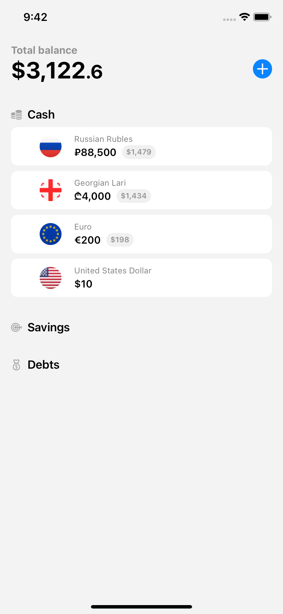
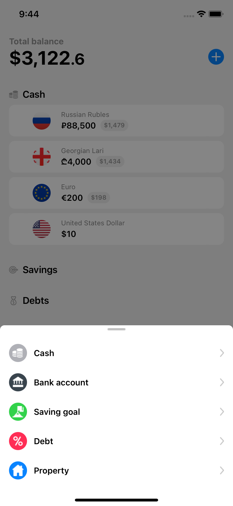
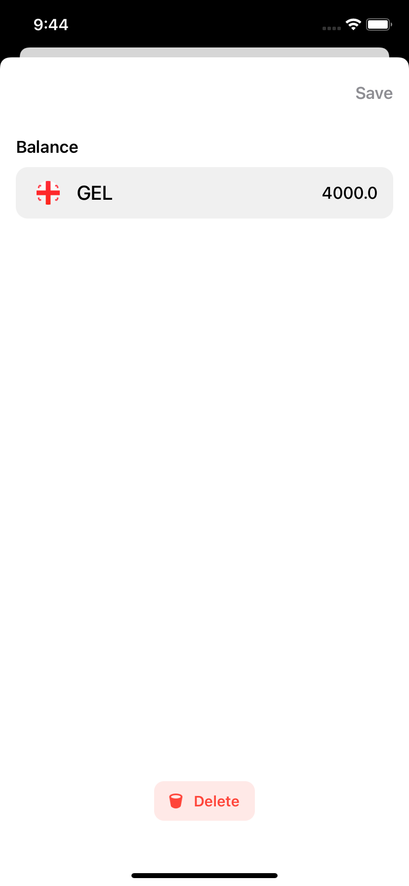
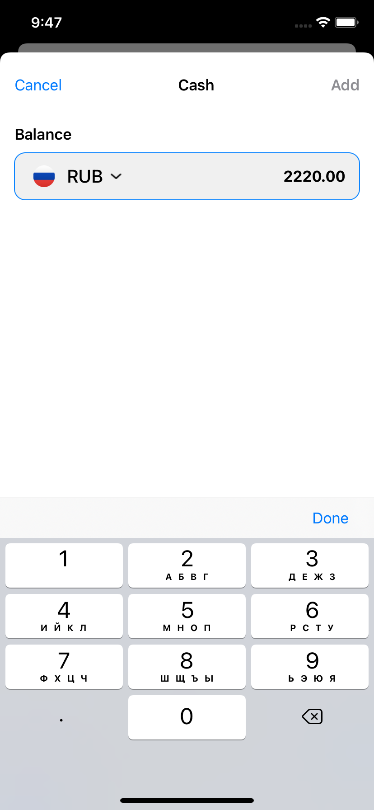
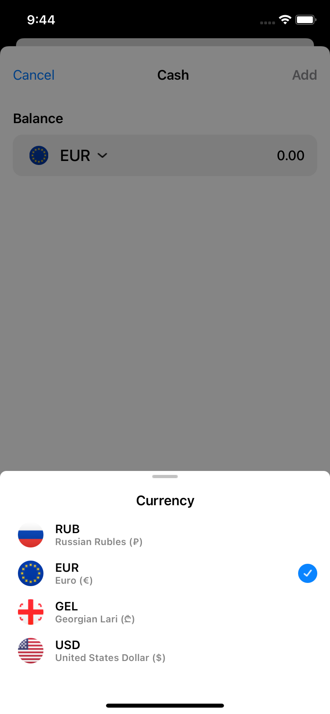

Finance app. You can add, remove, change cash in various currencies. Using the exchange.host API allows you to see the transfer of your money into the selected currency in real time (in this case, dollars, later it will depend on the application settings). In the future, thanks to the application, you will be able to set global financial goals and achieve them.

## Features

- SwiftUI 
- Implementation of the async await approach
- Using the exchange.host API + Alamofire
- CoreData as database
- Custom bottom sheet

## Screenshots

  
  
  
  
  

## Acknowledgements

 - [exchange.host API](https://exchangerate.host/#/)

## 🛠 Skills
SwiftUI, CoreData, API, Async/await, Alamofire

## Authors

- [@kaledinaoksana](https://github.com/kaledinaoksana) iOS developer 
- [@balshv](https://github.com/blshv) UI/UX designer

## 🔗 Links

